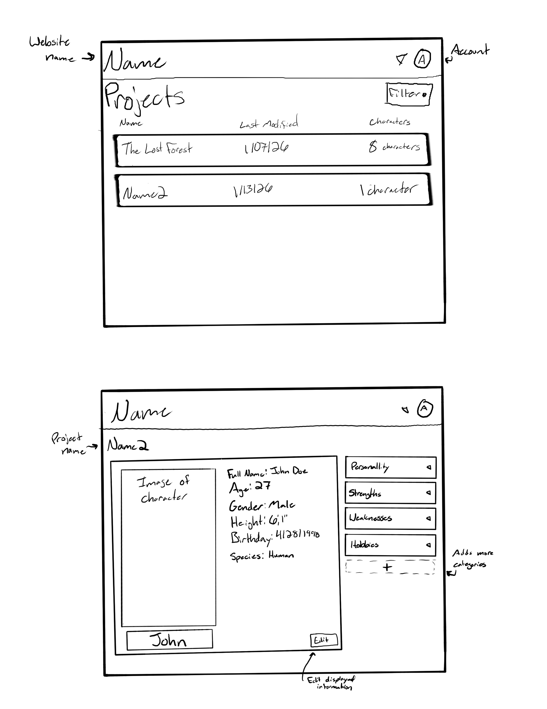

# Character Detail Organizer

[My Notes](notes.md)

This application allows creators to develop characters in a digital, organized space. It allows users to input information on their characters, an image of their characters, and share their characters with their friends.

<!-- If you are not familiar with Markdown then you should review the [documentation](https://docs.github.com/en/get-started/writing-on-github/getting-started-with-writing-and-formatting-on-github/basic-writing-and-formatting-syntax) before continuing. -->

## 🚀 Specification Deliverable

<!-- Fill in this sections as the submission artifact for this deliverable. You can refer to this [example](https://github.com/webprogramming260/startup-example/blob/main/README.md) for inspiration. -->

For this deliverable I did the following. I checked the box `[x]` and added a description for things I completed.

- [x] Proper use of Markdown
- [x] A concise and compelling elevator pitch
- [x] Description of key features
- [x] Description of how you will use each technology
- [x] One or more rough sketches of your application. Images must be embedded in this file using Markdown image references.

### Elevator pitch
Do you love to tell stories? Do you need a place to organize your thoughts? The Character Detail Organizer allows creators to insert character details in an organized fashion. What to share your character with a friend? No problem. In this application, creators can share their projects with their friends and even work on a project together. With the Character Detail Organizer, the only limit on character development is your imagination.


### Design



<!-- ```mermaid
sequenceDiagram
    actor You
    actor Website
    You->>Website: Replace this with your design
``` -->

### Key features

- Create projects and folders for additional organization
- Insert character information and images
- Share your work with friends
- Collaberate on a project with friends

### Technologies

I am going to use the required technologies in the following ways.

- **HTML** - Uses HTML to structure the website
- **CSS** - Uses CSS to design the website. It will organize character information like name, age, height, and more 
- **React** - Uses React to add interactivity so users can switch among multiple characters or projects and interact with friends' projects
- **Service** - Uses Services for storing and retrieving user character data, connecting with friends, and use https://avatars.dicebear.com/ for character design ideas     
- **DB/Login** - Uses databases to hold login information and character information
- **WebSocket** - Uses WebSocket to allow friends to edits characters together

## 🚀 AWS deliverable

For this deliverable I did the following. I checked the box `[x]` and added a description for things I completed.

- [x] **Server deployed and accessible with custom domain name** - [Lore Legend](https://lorelegend.click/).

## 🚀 HTML deliverable

For this deliverable I did the following. I checked the box `[x]` and added a description for things I completed.

- [x] **HTML pages** - I created five html pages: the main login page, the projects page (shows all the user's projects), the characters page (shows all the user's characters in a project), an example of a character set up, and a friends page.
- [x] **Proper HTML element usage** - I used header, footer, and main elements to keep content organized. I also used tables, input options like button and text, and div to keep things organized and formatting in my man body.
- [x] **Links** - I added links connecting all my pages
- [x] **Text** - I have text showing the user what character file or project they are in. The user will also be able to insert text to add infomatino about their characters.
- [x] **3rd party API placeholder** - I added a placeholder for the avatar generator.
- [x] **Images** - I added an image to act as a placeholder for the character image. The user will be able to change this image to an image they insert or an avatar generated.
- [x] **Login placeholder** - I added a login placeholder.
- [x] **DB data placeholder** - Login information and character information will be stored in the database.
- [x] **WebSocket placeholder** - Users can connect with friends and see if they are online, which will be done through websockets.

## 🚀 CSS deliverable

For this deliverable I did the following. I checked the box `[x]` and added a description for things I completed.

- [ ] **Visually appealing colors and layout. No overflowing elements.** - I did not complete this part of the deliverable.
- [x] **Use of a CSS framework** - I used Bootstrap to create an accordion.
- [ ] **All visual elements styled using CSS** - I did not complete this part of the deliverable.
- [ ] **Responsive to window resizing using flexbox and/or grid display** - I did not complete this part of the deliverable.
- [ ] **Use of a imported font** - I did not complete this part of the deliverable.
- [ ] **Use of different types of selectors including element, class, ID, and pseudo selectors** - I did not complete this part of the deliverable.

## 🚀 React part 1: Routing deliverable

For this deliverable I did the following. I checked the box `[x]` and added a description for things I completed.

- [ ] **Bundled using Vite** - I did not complete this part of the deliverable.
- [ ] **Components** - I did not complete this part of the deliverable.
- [ ] **Router** - I did not complete this part of the deliverable.

## 🚀 React part 2: Reactivity deliverable

For this deliverable I did the following. I checked the box `[x]` and added a description for things I completed.

- [ ] **All functionality implemented or mocked out** - I did not complete this part of the deliverable.
- [ ] **Hooks** - I did not complete this part of the deliverable.

## 🚀 Service deliverable

For this deliverable I did the following. I checked the box `[x]` and added a description for things I completed.

- [ ] **Node.js/Express HTTP service** - I did not complete this part of the deliverable.
- [ ] **Static middleware for frontend** - I did not complete this part of the deliverable.
- [ ] **Calls to third party endpoints** - I did not complete this part of the deliverable.
- [ ] **Backend service endpoints** - I did not complete this part of the deliverable.
- [ ] **Frontend calls service endpoints** - I did not complete this part of the deliverable.
- [ ] **Supports registration, login, logout, and restricted endpoint** - I did not complete this part of the deliverable.

## 🚀 DB deliverable

For this deliverable I did the following. I checked the box `[x]` and added a description for things I completed.

- [ ] **Stores data in MongoDB** - I did not complete this part of the deliverable.
- [ ] **Stores credentials in MongoDB** - I did not complete this part of the deliverable.

## 🚀 WebSocket deliverable

For this deliverable I did the following. I checked the box `[x]` and added a description for things I completed.

- [ ] **Backend listens for WebSocket connection** - I did not complete this part of the deliverable.
- [ ] **Frontend makes WebSocket connection** - I did not complete this part of the deliverable.
- [ ] **Data sent over WebSocket connection** - I did not complete this part of the deliverable.
- [ ] **WebSocket data displayed** - I did not complete this part of the deliverable.
- [ ] **Application is fully functional** - I did not complete this part of the deliverable.
